# System Architecture

## 🏗️ Architecture Overview

The Food Market Platform follows a **modern microservices-inspired architecture** with clear separation of concerns, scalability, and maintainability as primary design principles.

### High-Level Architecture

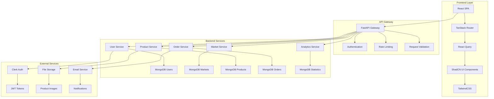

---

## 🎯 Design Principles

### 1. Accessibility First

- **Universal Design**: Interfaces work for users of all abilities
- **Progressive Enhancement**: Core functionality without JavaScript
- **Semantic HTML**: Proper markup for screen readers
- **Keyboard Navigation**: Full keyboard accessibility

### 2. Performance Optimization

- **<200ms API Response**: Fast backend processing
- **Lazy Loading**: Images and components loaded on demand
- **Caching Strategy**: Redis for frequently accessed data
- **CDN Integration**: Static assets delivery optimization

### 3. Security by Design

- **JWT Authentication**: Secure token-based authentication
- **Input Validation**: Pydantic schemas for data integrity
- **Rate Limiting**: API abuse prevention
- **HTTPS Enforcement**: Secure communication protocols

### 4. Scalability

- **Horizontal Scaling**: Stateless services for easy scaling
- **Database Indexing**: Optimized query performance
- **Microservices Ready**: Service decomposition for growth
- **Load Balancing**: Traffic distribution across instances

---

## 🏛️ System Components

### Frontend Architecture

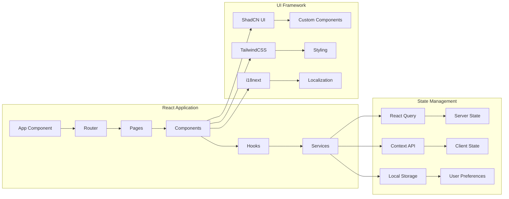

#### Component Hierarchy

```text
App/
├── Layout/
│   ├── Header/
│   │   ├── Navigation
│   │   ├── UserMenu
│   │   └── AccessibilityControls
│   ├── Sidebar/
│   │   ├── MarketList
│   │   └── CategoryFilter
│   └── Footer/
├── Pages/
│   ├── Home/
│   ├── Markets/
│   ├── Products/
│   ├── Cart/
│   ├── Orders/
│   └── Admin/
├── Components/
│   ├── Common/
│   │   ├── Button
│   │   ├── Input
│   │   ├── Modal
│   │   └── Loading
│   ├── Product/
│   │   ├── ProductCard
│   │   ├── ProductList
│   │   └── ProductDetail
│   └── Order/
│       ├── OrderSummary
│       ├── OrderHistory
│       └── OrderStatus
└── Hooks/
    ├── useAuth
    ├── useCart
    ├── useOrders
    └── useMarkets
```

### Backend Architecture

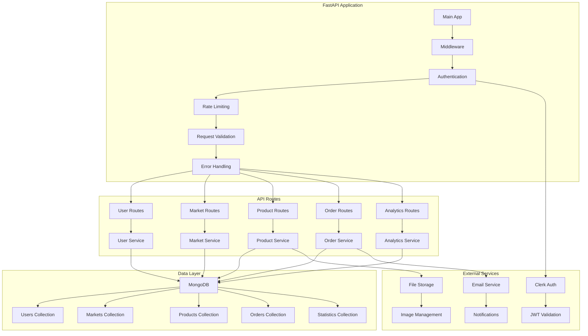

#### Service Structure

```text
backend/
├── app/
│   ├── main.py                 # FastAPI application entry point
│   ├── config.py              # Configuration management
│   ├── dependencies.py        # Dependency injection
│   ├── middleware/
│   │   ├── auth.py           # Authentication middleware
│   │   ├── cors.py           # CORS configuration
│   │   ├── rate_limit.py     # Rate limiting
│   │   └── logging.py        # Request logging
│   ├── models/
│   │   ├── user.py           # User data models
│   │   ├── market.py         # Market data models
│   │   ├── product.py        # Product data models
│   │   ├── order.py          # Order data models
│   │   └── statistics.py     # Statistics models
│   ├── services/
│   │   ├── user_service.py   # User business logic
│   │   ├── market_service.py # Market business logic
│   │   ├── product_service.py # Product business logic
│   │   ├── order_service.py  # Order business logic
│   │   └── analytics_service.py # Analytics logic
│   ├── api/
│   │   ├── v1/
│   │   │   ├── users.py      # User endpoints
│   │   │   ├── markets.py    # Market endpoints
│   │   │   ├── products.py   # Product endpoints
│   │   │   ├── orders.py     # Order endpoints
│   │   │   └── analytics.py  # Analytics endpoints
│   │   └── deps.py           # API dependencies
│   ├── core/
│   │   ├── security.py       # Security utilities
│   │   ├── database.py       # Database connection
│   │   └── exceptions.py     # Custom exceptions
│   └── utils/
│       ├── validators.py     # Custom validators
│       ├── helpers.py        # Utility functions
│       └── constants.py      # Application constants
├── tests/
│   ├── unit/
│   ├── integration/
│   └── e2e/
├── migrations/
├── requirements.txt
└── Dockerfile
```

---

## 🔄 Data Flow Architecture

### Request Flow

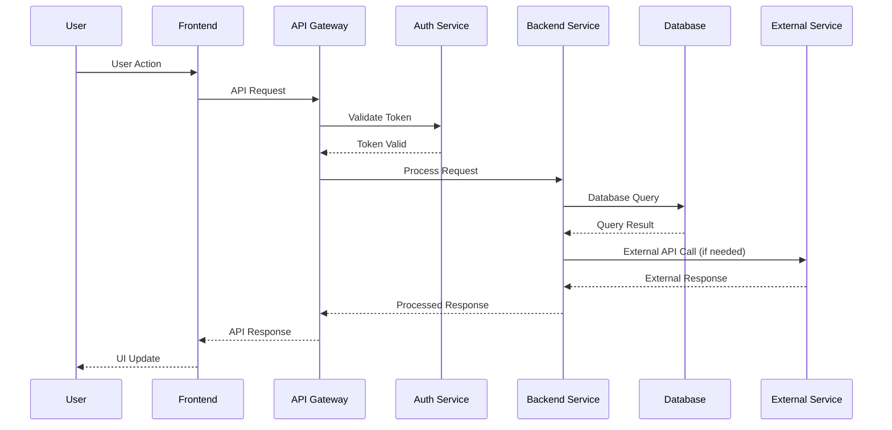

### Authentication Flow

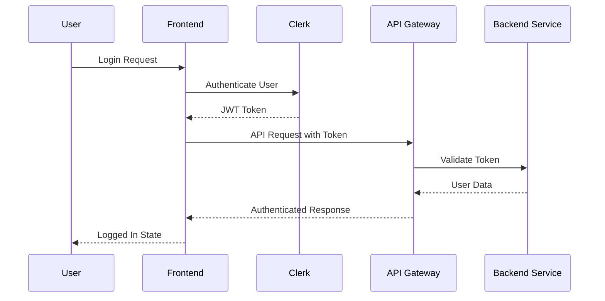

### Order Processing Flow

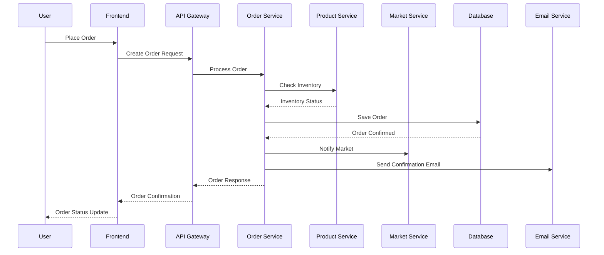

---

## 🗄️ Database Architecture

### MongoDB Collections Design

```mermaid
erDiagram
    USERS {
        ObjectId _id PK
        string email UK
        string name
        string role
        string locale
        string hashed_password
        datetime created_at
        datetime updated_at
        boolean is_active
        boolean email_verified
        datetime last_login
        object preferences
    }
    
    MARKETS {
        ObjectId _id PK
        string name
        string description
        string contact_email
        string contact_phone
        string address
        object coordinates
        object business_hours
        array delivery_options
        array payment_methods
        ObjectId owner_id FK
        datetime created_at
        datetime updated_at
        boolean verified
        float rating
        int total_orders
        float total_revenue
    }
    
    PRODUCTS {
        ObjectId _id PK
        ObjectId market_id FK
        string name
        string description
        decimal price
        int stock_quantity
        string category
        string sub_category
        array tags
        array images
        string unit
        float weight
        object dimensions
        boolean is_active
        boolean featured
        datetime created_at
        datetime updated_at
        int total_sold
        decimal total_revenue
        float rating
        int review_count
    }
    
    ORDERS {
        ObjectId _id PK
        string order_number UK
        ObjectId user_id FK
        ObjectId market_id FK
        array items
        string comment
        string status
        string delivery_option
        string delivery_address
        datetime delivery_time
        decimal total_amount
        decimal tax_amount
        decimal discount_amount
        decimal final_amount
        datetime created_at
        datetime updated_at
        datetime confirmed_at
        datetime prepared_at
        datetime ready_at
        datetime delivered_at
        datetime cancelled_at
        string cancelled_reason
        string payment_status
        string payment_method
        datetime estimated_delivery
    }
    
    STATISTICS {
        ObjectId _id PK
        string type
        ObjectId entity_id
        object data
        datetime created_at
        datetime updated_at
    }
    
    USERS ||--o{ MARKETS : "owns"
    MARKETS ||--o{ PRODUCTS : "has"
    USERS ||--o{ ORDERS : "places"
    MARKETS ||--o{ ORDERS : "receives"
    PRODUCTS ||--o{ ORDERS : "included_in"
```

### Indexing Strategy

#### Primary Indexes

```javascript
// Users collection
db.users.createIndex({ "email": 1 }, { unique: true })
db.users.createIndex({ "role": 1 })
db.users.createIndex({ "is_active": 1 })
db.users.createIndex({ "created_at": -1 })

// Markets collection
db.markets.createIndex({ "owner_id": 1 })
db.markets.createIndex({ "is_active": 1 })
db.markets.createIndex({ "verified": 1 })
db.markets.createIndex({ "coordinates": "2dsphere" })
db.markets.createIndex({ "created_at": -1 })

// Products collection
db.products.createIndex({ "market_id": 1 })
db.products.createIndex({ "category": 1 })
db.products.createIndex({ "is_active": 1 })
db.products.createIndex({ "featured": 1 })
db.products.createIndex({ "name": "text", "description": "text" })
db.products.createIndex({ "created_at": -1 })

// Orders collection
db.orders.createIndex({ "user_id": 1 })
db.orders.createIndex({ "market_id": 1 })
db.orders.createIndex({ "status": 1 })
db.orders.createIndex({ "created_at": -1 })
db.orders.createIndex({ "order_number": 1 }, { unique: true })
db.orders.createIndex({ "payment_status": 1 })
```

#### Compound Indexes

```javascript
// Market products by category and status
db.products.createIndex({ "market_id": 1, "category": 1, "is_active": 1 })

// User orders by status and date
db.orders.createIndex({ "user_id": 1, "status": 1, "created_at": -1 })

// Market orders by status and date
db.orders.createIndex({ "market_id": 1, "status": 1, "created_at": -1 })

// Product search optimization
db.products.createIndex({ "market_id": 1, "name": "text", "tags": 1 })
```

---

## 🔒 Security Architecture

### Authentication & Authorization

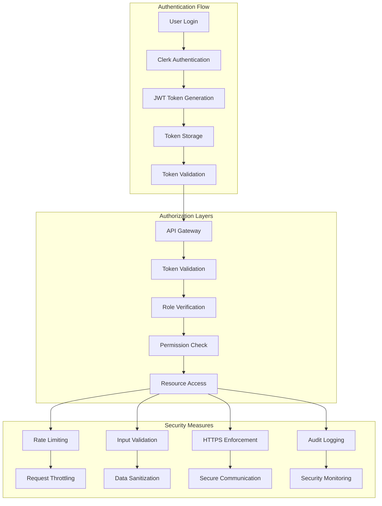

### Security Components

#### 1. Authentication Service

- **Clerk Integration**: Third-party authentication provider
- **JWT Tokens**: Secure session management
- **Token Refresh**: Automatic token renewal
- **Multi-factor Authentication**: Enhanced security

#### 2. Authorization System

- **Role-based Access Control (RBAC)**: User, Market Admin, Super Admin
- **Permission Matrix**: Granular access control
- **Resource-level Security**: Individual resource protection
- **Session Management**: Secure session handling

#### 3. Data Protection

- **Input Validation**: Pydantic schemas for data integrity
- **SQL Injection Prevention**: Parameterized queries
- **XSS Protection**: Content Security Policy
- **CSRF Protection**: Cross-site request forgery prevention

#### 4. Network Security

- **HTTPS Enforcement**: TLS/SSL encryption
- **CORS Configuration**: Cross-origin resource sharing
- **Rate Limiting**: API abuse prevention
- **DDoS Protection**: Distributed denial of service mitigation

---

## 📊 Performance Architecture

### Caching Strategy

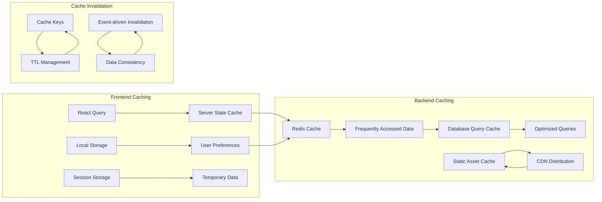

### Performance Optimization

#### 1. Frontend Optimization

- **Code Splitting**: Lazy loading of components
- **Bundle Optimization**: Tree shaking and minification
- **Image Optimization**: WebP format and lazy loading
- **Service Workers**: Offline functionality

#### 2. Backend Optimization

- **Database Indexing**: Optimized query performance
- **Connection Pooling**: Efficient database connections
- **Async Processing**: Non-blocking operations
- **Compression**: Gzip response compression

#### 3. Network Optimization

- **CDN Integration**: Global content delivery
- **HTTP/2 Support**: Multiplexed connections
- **Resource Hints**: Preload and prefetch
- **Compression**: Response size reduction

---

## 🚀 Deployment Architecture

### Container Architecture

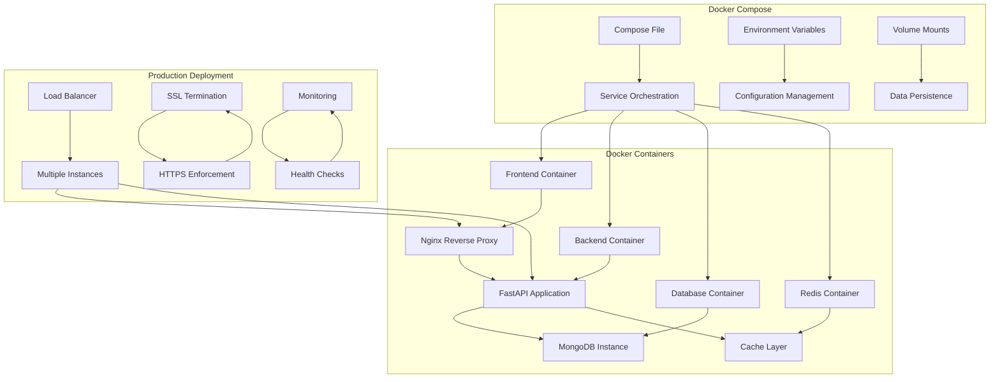

### Deployment Strategy

#### 1. Development Environment

- **Local Development**: Docker Compose for local setup
- **Hot Reloading**: Automatic code reloading
- **Debug Tools**: Development debugging utilities
- **Mock Services**: Simulated external services

#### 2. Staging Environment

- **Production-like**: Mirrors production configuration
- **Testing Ground**: Integration and E2E testing
- **Performance Testing**: Load and stress testing
- **Security Testing**: Vulnerability assessment

#### 3. Production Environment

- **High Availability**: Multiple instance deployment
- **Auto-scaling**: Dynamic resource allocation
- **Monitoring**: Real-time system monitoring
- **Backup Strategy**: Automated data backup

---

## 🔍 Monitoring & Observability

### Monitoring Architecture

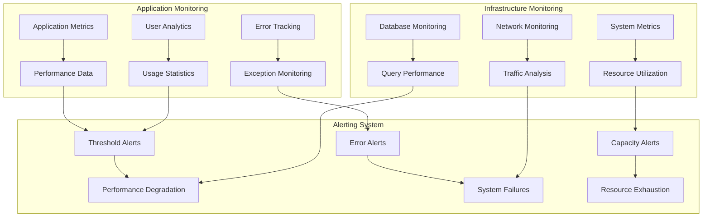

### Monitoring Components

#### 1. Application Performance Monitoring (APM)

- **Response Time Tracking**: API endpoint performance
- **Error Rate Monitoring**: Exception tracking
- **User Experience Metrics**: Frontend performance
- **Business Metrics**: Order completion rates

#### 2. Infrastructure Monitoring

- **Server Metrics**: CPU, memory, disk usage
- **Database Performance**: Query execution times
- **Network Monitoring**: Bandwidth and latency
- **Container Health**: Docker container status

#### 3. Logging & Tracing

- **Structured Logging**: JSON format logs
- **Distributed Tracing**: Request flow tracking
- **Audit Logging**: Security event logging
- **Error Logging**: Exception details

#### 4. Alerting & Notification

- **Threshold-based Alerts**: Performance degradation
- **Anomaly Detection**: Unusual system behavior
- **Escalation Procedures**: Alert routing
- **Notification Channels**: Email, Slack, SMS

---

## 🔄 CI/CD Pipeline

### Deployment Pipeline

```mermaid
graph LR
    A[Code Commit] --> B[GitHub Actions]
    B --> C[Code Quality Checks]
    C --> D[Unit Tests]
    D --> E[Integration Tests]
    E --> F[Security Scan]
    F --> G[Build Artifacts]
    G --> H[Deploy to Staging]
    H --> I[E2E Tests]
    I --> J[Deploy to Production]
    J --> K[Health Checks]
    K --> L[Monitoring]
```

### Pipeline Stages

#### 1. Code Quality

- **Linting**: Code style enforcement
- **Type Checking**: TypeScript validation
- **Security Scanning**: Vulnerability detection
- **Code Coverage**: Test coverage reporting

#### 2. Testing

- **Unit Tests**: Individual component testing
- **Integration Tests**: Service interaction testing
- **E2E Tests**: Full user journey testing
- **Performance Tests**: Load and stress testing

#### 3. Deployment

- **Staging Deployment**: Pre-production testing
- **Production Deployment**: Live environment update
- **Rollback Strategy**: Quick recovery procedures
- **Blue-Green Deployment**: Zero-downtime updates

---

## 📈 Scalability Considerations

### Horizontal Scaling

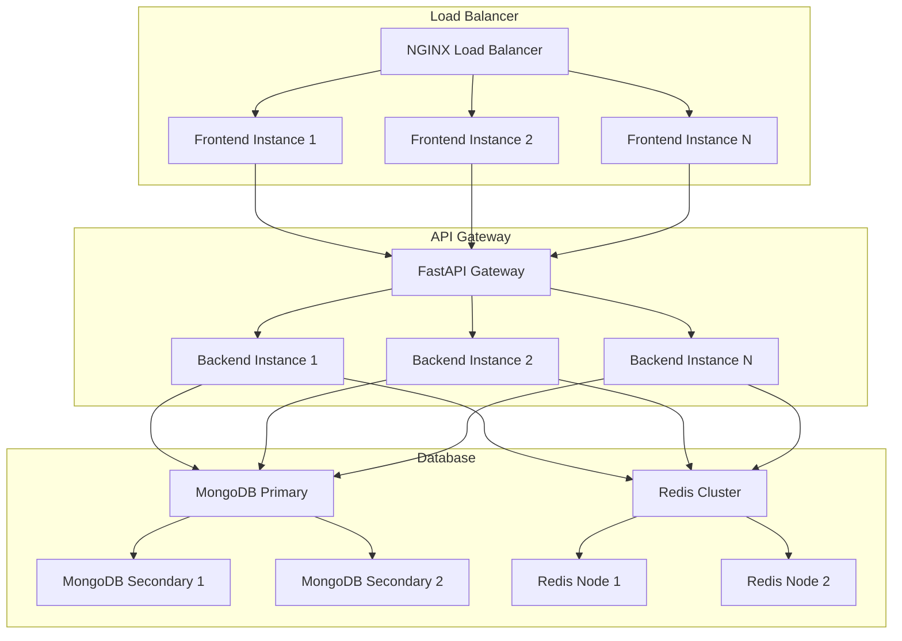

### Scaling Strategies

#### 1. Application Scaling

- **Stateless Services**: Easy horizontal scaling
- **Load Balancing**: Traffic distribution
- **Auto-scaling**: Dynamic resource allocation
- **Microservices**: Service decomposition

#### 2. Database Scaling

- **Read Replicas**: Query distribution
- **Sharding**: Data partitioning
- **Caching**: Redis for performance
- **Connection Pooling**: Efficient connections

#### 3. Infrastructure Scaling

- **Container Orchestration**: Kubernetes deployment
- **Cloud Services**: AWS/GCP/Azure integration
- **CDN**: Global content delivery
- **Edge Computing**: Local processing
