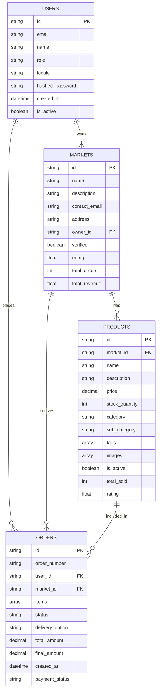

# Data Models

## 🗄️ Database Overview

The Food Market Platform uses **MongoDB** as the primary database with **Pydantic schemas** for backend validation and **TypeScript interfaces** for frontend type safety.

### Database Collections

- `users` - User accounts and authentication
- `markets` - Food market information
- `products` - Product catalog and inventory
- `orders` - Order management and tracking
- `statistics` - Analytics and reporting data

---

## 👤 User Models

### User Base Schema

```python
# backend/models/user.py
from pydantic import BaseModel, EmailStr, Field
from typing import Literal, Optional
from datetime import datetime

class UserBase(BaseModel):
    email: EmailStr
    name: str = Field(..., max_length=100)
    role: Literal["customer", "market_admin", "super_admin"] = "customer"
    locale: Literal["en", "ua"] = "en"
    phone: Optional[str] = None
    address: Optional[str] = None
    preferences: dict = Field(default_factory=dict)
```

### User Creation Schema

```python
class UserCreate(UserBase):
    password: str = Field(..., min_length=8)
    confirm_password: str
    
    class Config:
        json_schema_extra = {
            "example": {
                "email": "user@example.com",
                "name": "John Doe",
                "password": "securepassword123",
                "confirm_password": "securepassword123",
                "role": "customer",
                "locale": "en"
            }
        }
```

### User Database Schema

```python
class UserInDB(UserBase):
    id: str = Field(alias="_id")
    hashed_password: str
    created_at: datetime = Field(default_factory=datetime.utcnow)
    updated_at: datetime = Field(default_factory=datetime.utcnow)
    is_active: bool = True
    email_verified: bool = False
    last_login: Optional[datetime] = None
```

### User Public Schema

```python
class UserPublic(UserBase):
    id: str
    created_at: datetime
    is_active: bool
    
    class Config:
        from_attributes = True
```

### Frontend TypeScript Interface

```typescript
// frontend/types/user.ts
export type UserRole = "customer" | "market_admin" | "super_admin";
export type UserLocale = "en" | "ua";

export interface UserPreferences {
  fontSize?: "small" | "medium" | "large" | "extra-large";
  theme?: "light" | "dark" | "high-contrast";
  notifications?: {
    email?: boolean;
    push?: boolean;
    sms?: boolean;
  };
}

export interface UserPublic {
  id: string;
  email: string;
  name: string;
  role: UserRole;
  locale: UserLocale;
  phone?: string;
  address?: string;
  preferences: UserPreferences;
  created_at: string;
  is_active: boolean;
}

export interface UserCreate {
  email: string;
  name: string;
  password: string;
  confirm_password: string;
  role?: UserRole;
  locale?: UserLocale;
  phone?: string;
  address?: string;
}
```

---

## 🏪 Market Models

### Market Base Schema

```python
# backend/models/market.py
from pydantic import BaseModel, Field, EmailStr
from typing import Optional, List
from datetime import time

class MarketBase(BaseModel):
    name: str = Field(..., max_length=200)
    description: Optional[str] = None
    contact_email: EmailStr
    contact_phone: Optional[str] = None
    address: str
    coordinates: Optional[dict] = None  # {lat: float, lng: float}
    business_hours: dict = Field(default_factory=dict)
    delivery_options: List[str] = ["pickup"]
    payment_methods: List[str] = ["cash", "card"]
    is_active: bool = True
```

### Market Creation Schema

```python
class MarketCreate(MarketBase):
    owner_id: str
    
    class Config:
        json_schema_extra = {
            "example": {
                "name": "Fresh Market",
                "description": "Local fresh produce market",
                "contact_email": "contact@freshmarket.com",
                "contact_phone": "+1234567890",
                "address": "123 Main St, City, State",
                "owner_id": "user_id_here"
            }
        }
```

### Market Database Schema

```python
class MarketInDB(MarketBase):
    id: str = Field(alias="_id")
    owner_id: str
    created_at: datetime = Field(default_factory=datetime.utcnow)
    updated_at: datetime = Field(default_factory=datetime.utcnow)
    verified: bool = False
    rating: float = 0.0
    total_orders: int = 0
    total_revenue: float = 0.0
```

### Market Public Schema

```python
class MarketPublic(MarketBase):
    id: str
    owner_id: str
    created_at: datetime
    verified: bool
    rating: float
    total_orders: int
    total_revenue: float
    
    class Config:
        from_attributes = True
```

### Frontend TypeScript Interface

```typescript
// frontend/types/market.ts
export interface BusinessHours {
  monday?: { open: string; close: string };
  tuesday?: { open: string; close: string };
  wednesday?: { open: string; close: string };
  thursday?: { open: string; close: string };
  friday?: { open: string; close: string };
  saturday?: { open: string; close: string };
  sunday?: { open: string; close: string };
}

export interface Coordinates {
  lat: number;
  lng: number;
}

export interface MarketPublic {
  id: string;
  name: string;
  description?: string;
  contact_email: string;
  contact_phone?: string;
  address: string;
  coordinates?: Coordinates;
  business_hours: BusinessHours;
  delivery_options: string[];
  payment_methods: string[];
  is_active: boolean;
  owner_id: string;
  created_at: string;
  verified: boolean;
  rating: number;
  total_orders: number;
  total_revenue: number;
}
```

---

## 🛍️ Product Models

### Product Base Schema

```python
# backend/models/product.py
from pydantic import BaseModel, Field
from typing import Optional, List
from decimal import Decimal

class ProductBase(BaseModel):
    market_id: str
    name: str = Field(..., max_length=200)
    description: Optional[str] = None
    price: Decimal = Field(..., decimal_places=2)
    stock_quantity: int = Field(..., ge=0)
    category: str
    sub_category: Optional[str] = None
    tags: List[str] = []
    images: List[str] = []
    unit: str = "piece"  # piece, kg, liter, etc.
    weight: Optional[float] = None  # in grams
    dimensions: Optional[dict] = None  # {length, width, height}
    is_active: bool = True
    featured: bool = False
```

### Product Creation Schema

```python
class ProductCreate(ProductBase):
    pass
    
    class Config:
        json_schema_extra = {
            "example": {
                "market_id": "market_id_here",
                "name": "Fresh Apples",
                "description": "Organic red apples",
                "price": "2.99",
                "stock_quantity": 100,
                "category": "fruits",
                "sub_category": "apples",
                "tags": ["organic", "fresh", "local"],
                "unit": "kg"
            }
        }
```

### Product Database Schema

```python
class ProductInDB(ProductBase):
    id: str = Field(alias="_id")
    created_at: datetime = Field(default_factory=datetime.utcnow)
    updated_at: datetime = Field(default_factory=datetime.utcnow)
    total_sold: int = 0
    total_revenue: Decimal = Decimal("0.00")
    rating: float = 0.0
    review_count: int = 0
```

### Product Public Schema

```python
class ProductPublic(ProductBase):
    id: str
    created_at: datetime
    total_sold: int
    total_revenue: Decimal
    rating: float
    review_count: int
    
    class Config:
        from_attributes = True
```

### Frontend TypeScript Interface

```typescript
// frontend/types/product.ts
export interface ProductDimensions {
  length?: number;
  width?: number;
  height?: number;
}

export interface ProductPublic {
  id: string;
  market_id: string;
  name: string;
  description?: string;
  price: number;
  stock_quantity: number;
  category: string;
  sub_category?: string;
  tags: string[];
  images: string[];
  unit: string;
  weight?: number;
  dimensions?: ProductDimensions;
  is_active: boolean;
  featured: boolean;
  created_at: string;
  total_sold: number;
  total_revenue: number;
  rating: number;
  review_count: number;
}

export interface ProductCreate {
  market_id: string;
  name: string;
  description?: string;
  price: number;
  stock_quantity: number;
  category: string;
  sub_category?: string;
  tags?: string[];
  images?: string[];
  unit?: string;
  weight?: number;
  dimensions?: ProductDimensions;
  featured?: boolean;
}
```

---

## 📦 Order Models

### Order Item Schema

```python
# backend/models/order.py
from pydantic import BaseModel, Field
from typing import List, Optional
from decimal import Decimal

class OrderItem(BaseModel):
    product_id: str
    quantity: int = Field(..., gt=0)
    unit_price: Decimal
    total_price: Decimal
    
    class Config:
        json_schema_extra = {
            "example": {
                "product_id": "product_id_here",
                "quantity": 2,
                "unit_price": "2.99",
                "total_price": "5.98"
            }
        }
```

### Order Base Schema

```python
class OrderBase(BaseModel):
    user_id: str
    market_id: str
    items: List[OrderItem]
    comment: Optional[str] = None
    status: str = Field(default="pending", regex="^(pending|confirmed|preparing|ready|delivered|cancelled)$")
    delivery_option: str = "pickup"  # pickup, delivery
    delivery_address: Optional[str] = None
    delivery_time: Optional[datetime] = None
    total_amount: Decimal
    tax_amount: Decimal = Decimal("0.00")
    discount_amount: Decimal = Decimal("0.00")
    final_amount: Decimal
```

### Order Creation Schema

```python
class OrderCreate(OrderBase):
    pass
    
    class Config:
        json_schema_extra = {
            "example": {
                "user_id": "user_id_here",
                "market_id": "market_id_here",
                "items": [
                    {
                        "product_id": "product_id_here",
                        "quantity": 2,
                        "unit_price": "2.99",
                        "total_price": "5.98"
                    }
                ],
                "comment": "Please pack carefully",
                "delivery_option": "pickup",
                "total_amount": "5.98",
                "final_amount": "5.98"
            }
        }
```

### Order Database Schema

```python
class OrderInDB(OrderBase):
    id: str = Field(alias="_id")
    order_number: str
    created_at: datetime = Field(default_factory=datetime.utcnow)
    updated_at: datetime = Field(default_factory=datetime.utcnow)
    confirmed_at: Optional[datetime] = None
    prepared_at: Optional[datetime] = None
    ready_at: Optional[datetime] = None
    delivered_at: Optional[datetime] = None
    cancelled_at: Optional[datetime] = None
    cancelled_reason: Optional[str] = None
    payment_status: str = "pending"  # pending, paid, failed, refunded
    payment_method: Optional[str] = None
    estimated_delivery: Optional[datetime] = None
```

### Order Public Schema

```python
class OrderPublic(OrderBase):
    id: str
    order_number: str
    created_at: datetime
    updated_at: datetime
    confirmed_at: Optional[datetime]
    prepared_at: Optional[datetime]
    ready_at: Optional[datetime]
    delivered_at: Optional[datetime]
    cancelled_at: Optional[datetime]
    cancelled_reason: Optional[str]
    payment_status: str
    payment_method: Optional[str]
    estimated_delivery: Optional[datetime]
    
    class Config:
        from_attributes = True
```

### Frontend TypeScript Interface

```typescript
// frontend/types/order.ts
export type OrderStatus = "pending" | "confirmed" | "preparing" | "ready" | "delivered" | "cancelled";
export type PaymentStatus = "pending" | "paid" | "failed" | "refunded";
export type DeliveryOption = "pickup" | "delivery";

export interface OrderItem {
  product_id: string;
  quantity: number;
  unit_price: number;
  total_price: number;
}

export interface OrderPublic {
  id: string;
  order_number: string;
  user_id: string;
  market_id: string;
  items: OrderItem[];
  comment?: string;
  status: OrderStatus;
  delivery_option: DeliveryOption;
  delivery_address?: string;
  delivery_time?: string;
  total_amount: number;
  tax_amount: number;
  discount_amount: number;
  final_amount: number;
  created_at: string;
  updated_at: string;
  confirmed_at?: string;
  prepared_at?: string;
  ready_at?: string;
  delivered_at?: string;
  cancelled_at?: string;
  cancelled_reason?: string;
  payment_status: PaymentStatus;
  payment_method?: string;
  estimated_delivery?: string;
}

export interface OrderCreate {
  user_id: string;
  market_id: string;
  items: OrderItem[];
  comment?: string;
  delivery_option: DeliveryOption;
  delivery_address?: string;
  delivery_time?: string;
  total_amount: number;
  final_amount: number;
}
```

---

## 📊 Statistics Models

### Product Statistics Schema

```python
# backend/models/statistics.py
from pydantic import BaseModel
from decimal import Decimal
from datetime import datetime, date

class ProductStats(BaseModel):
    product_id: str
    product_name: str
    total_orders: int
    total_sold: int
    revenue: Decimal
    average_rating: float
    review_count: int
    last_ordered: Optional[datetime] = None
```

### Market Statistics Schema

```python
class MarketStats(BaseModel):
    market_id: str
    market_name: str
    total_orders: int
    total_revenue: Decimal
    total_customers: int
    average_order_value: Decimal
    top_products: List[ProductStats]
    order_status_distribution: dict
    daily_sales: List[dict]  # [{date: str, revenue: float, orders: int}]
    monthly_sales: List[dict]  # [{month: str, revenue: float, orders: int}]
```

### Platform Statistics Schema

```python
class PlatformStats(BaseModel):
    total_users: int
    total_markets: int
    total_products: int
    total_orders: int
    total_revenue: Decimal
    active_markets: int
    active_users: int
    average_order_value: Decimal
    top_markets: List[MarketStats]
    system_health: dict
    performance_metrics: dict
```

### Frontend TypeScript Interface

```typescript
// frontend/types/statistics.ts
export interface ProductStats {
  product_id: string;
  product_name: string;
  total_orders: number;
  total_sold: number;
  revenue: number;
  average_rating: number;
  review_count: number;
  last_ordered?: string;
}

export interface MarketStats {
  market_id: string;
  market_name: string;
  total_orders: number;
  total_revenue: number;
  total_customers: number;
  average_order_value: number;
  top_products: ProductStats[];
  order_status_distribution: Record<string, number>;
  daily_sales: Array<{ date: string; revenue: number; orders: number }>;
  monthly_sales: Array<{ month: string; revenue: number; orders: number }>;
}

export interface PlatformStats {
  total_users: number;
  total_markets: number;
  total_products: number;
  total_orders: number;
  total_revenue: number;
  active_markets: number;
  active_users: number;
  average_order_value: number;
  top_markets: MarketStats[];
  system_health: Record<string, any>;
  performance_metrics: Record<string, any>;
}
```

---

## 🔗 Data Relationships

### Entity Relationship Diagram



### Relationship Details

#### 1. User ↔ Market (One-to-Many)

- **Relationship**: One user (market_admin) can own multiple markets
- **Foreign Key**: `markets.owner_id` references `users.id`
- **Cascade**: When user is deleted, their markets are deactivated

#### 2. Market ↔ Product (One-to-Many)

- **Relationship**: One market can have many products
- **Foreign Key**: `products.market_id` references `markets.id`
- **Cascade**: When market is deleted, all products are deactivated

#### 3. User ↔ Order (One-to-Many)

- **Relationship**: One user can place multiple orders
- **Foreign Key**: `orders.user_id` references `users.id`
- **Cascade**: When user is deleted, their orders are preserved for audit

#### 4. Market ↔ Order (One-to-Many)

- **Relationship**: One market can receive multiple orders
- **Foreign Key**: `orders.market_id` references `markets.id`
- **Cascade**: When market is deleted, orders are preserved for audit

#### 5. Product ↔ Order (Many-to-Many via OrderItem)

- **Relationship**: Products and orders have a many-to-many relationship
- **Intermediate**: `OrderItem` contains product_id, quantity, and pricing
- **Cascade**: When product is deleted, order items are preserved for audit

---

## 📋 Database Indexes

### Performance Optimization Indexes

```javascript
// Users collection
db.users.createIndex({ "email": 1 }, { unique: true })
db.users.createIndex({ "role": 1 })
db.users.createIndex({ "is_active": 1 })

// Markets collection
db.markets.createIndex({ "owner_id": 1 })
db.markets.createIndex({ "is_active": 1 })
db.markets.createIndex({ "verified": 1 })
db.markets.createIndex({ "coordinates": "2dsphere" }) // For geospatial queries

// Products collection
db.products.createIndex({ "market_id": 1 })
db.products.createIndex({ "category": 1 })
db.products.createIndex({ "is_active": 1 })
db.products.createIndex({ "featured": 1 })
db.products.createIndex({ "name": "text", "description": "text" }) // Text search

// Orders collection
db.orders.createIndex({ "user_id": 1 })
db.orders.createIndex({ "market_id": 1 })
db.orders.createIndex({ "status": 1 })
db.orders.createIndex({ "created_at": -1 })
db.orders.createIndex({ "order_number": 1 }, { unique: true })
```

---

## 🔄 Data Validation Rules

### User Validation

- Email must be unique and valid format
- Password minimum 8 characters with complexity requirements
- Name maximum 100 characters
- Role must be one of: customer, market_admin, super_admin

### Market Validation

- Name maximum 200 characters
- Contact email must be valid format
- Address is required
- Business hours must be valid time format

### Product Validation

- Name maximum 200 characters
- Price must be positive decimal
- Stock quantity must be non-negative integer
- Category is required
- Images must be valid URLs

### Order Validation

- Order number must be unique
- Items array cannot be empty
- Quantities must be positive integers
- Total amounts must match calculated values
- Status must be valid enum value

---

## 🗃️ Data Migration Strategy

### Version Control

- Schema versioning with migration scripts
- Backward compatibility for API changes
- Data transformation utilities

### Migration Process

1. **Backup**: Create database backup before migration
2. **Test**: Run migration on staging environment
3. **Deploy**: Execute migration during maintenance window
4. **Verify**: Confirm data integrity after migration
5. **Rollback**: Plan for rollback if issues arise

### Example Migration Script

```python
# migrations/v1_to_v2.py
from pymongo import MongoClient
from datetime import datetime

def migrate_users_v1_to_v2():
    client = MongoClient()
    db = client.food_market
    
    # Add new fields to existing users
    db.users.update_many(
        {"preferences": {"$exists": False}},
        {"$set": {
            "preferences": {
                "fontSize": "medium",
                "theme": "light",
                "notifications": {"email": True, "push": False, "sms": False}
            },
            "updated_at": datetime.utcnow()
        }}
    )
    
    # Add indexes for new fields
    db.users.create_index("preferences.fontSize")
    db.users.create_index("preferences.theme")
```
