# User Flows

## 👤 User Personas

### 1. Elderly Customer (Primary User)

- **Name**: Maria, 72 years old
- **Tech Comfort**: Basic smartphone usage
- **Goals**: Easy food shopping, maintaining independence
- **Pain Points**: Small text, complex navigation, physical store access

### 2. Market Admin

- **Name**: Alex, 35 years old
- **Role**: Local market owner
- **Goals**: Manage inventory, process orders, grow business
- **Pain Points**: Manual processes, limited insights

### 3. Super Admin

- **Name**: Sarah, 28 years old
- **Role**: Platform administrator
- **Goals**: Platform management, user support, system monitoring
- **Pain Points**: Multiple market coordination, system maintenance

---

## 🔄 Customer User Flows

### 1. Registration & Onboarding Flow

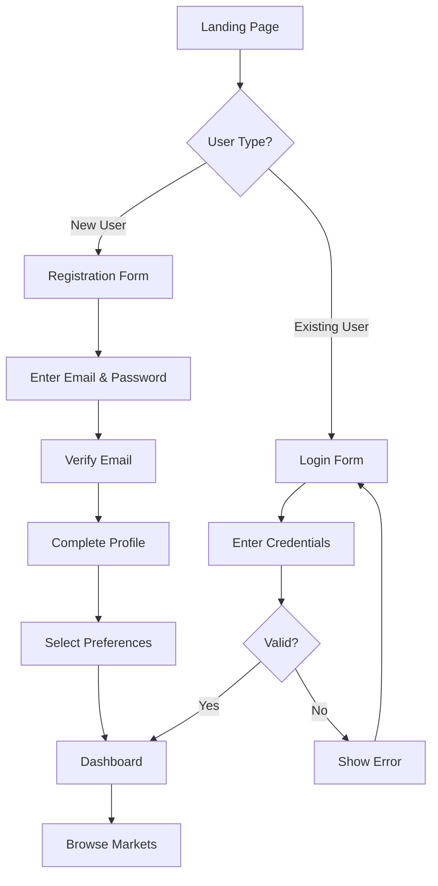

**Steps:**

1. **Landing Page**: User arrives at platform homepage
2. **Registration**: New users create account with email/password
3. **Email Verification**: Confirm email address
4. **Profile Setup**: Enter name, contact information
5. **Preferences**: Select language, accessibility settings
6. **Dashboard**: Access to main application

### 2. Market Browsing Flow

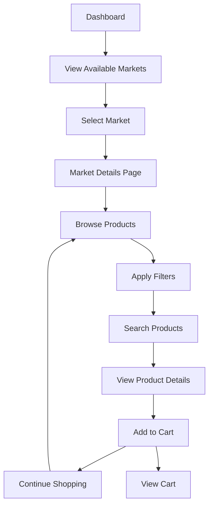

**Steps:**

1. **Market Selection**: Choose from available food markets
2. **Product Browsing**: View catalog with categories
3. **Filtering**: Filter by category, price, availability
4. **Search**: Find specific products
5. **Product Details**: View images, descriptions, pricing
6. **Cart Management**: Add items to shopping cart

### 3. Order Placement Flow

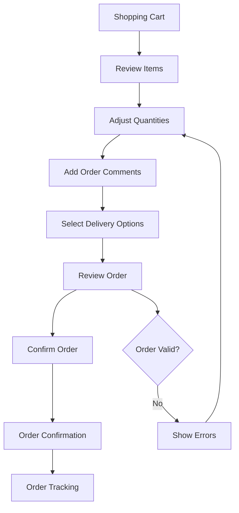

**Steps:**

1. **Cart Review**: Check items, quantities, total price
2. **Order Comments**: Add special instructions or requests
3. **Delivery Options**: Choose pickup or delivery
4. **Order Confirmation**: Final review before submission
5. **Payment Processing**: Secure payment handling
6. **Order Tracking**: Monitor order status

### 4. Order Tracking Flow

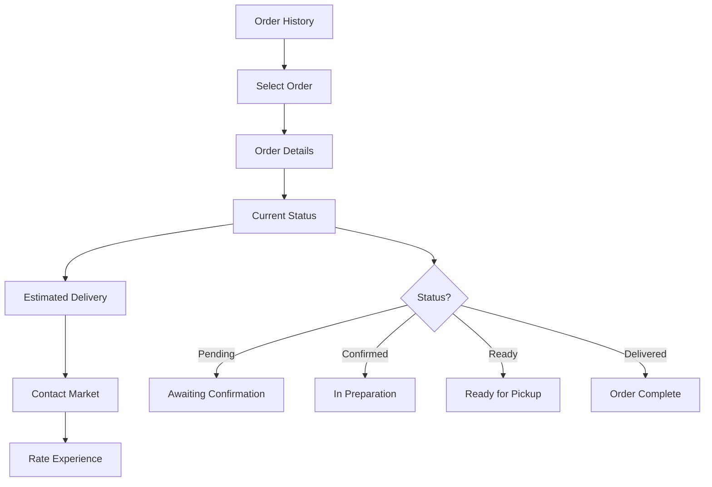

**Steps:**

1. **Order History**: View all past and current orders
2. **Status Tracking**: Real-time order status updates
3. **Communication**: Contact market for questions
4. **Feedback**: Rate and review experience
5. **Reordering**: Quick reorder from previous orders

---

## 🏪 Market Admin User Flows

### 1. Market Setup Flow

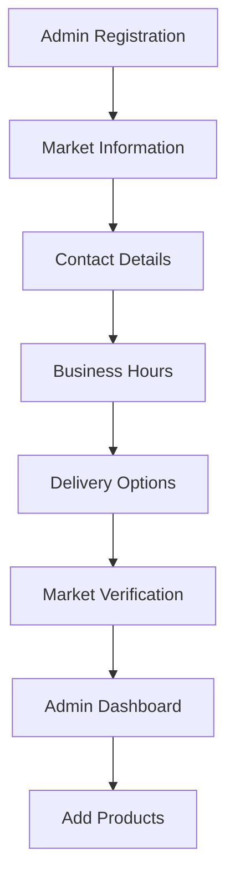

**Steps:**

1. **Registration**: Create admin account
2. **Market Profile**: Enter business information
3. **Verification**: Platform verification process
4. **Dashboard Access**: Access admin interface
5. **Initial Setup**: Configure market settings

### 2. Inventory Management Flow

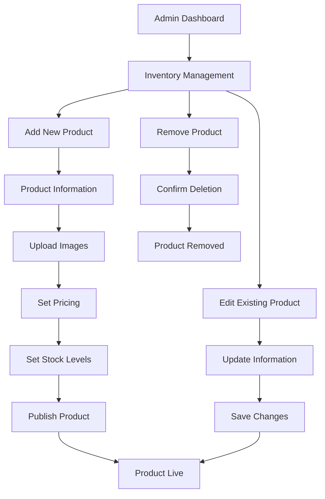

**Steps:**

1. **Product Creation**: Add new products to catalog
2. **Image Management**: Upload and organize product images
3. **Pricing Strategy**: Set competitive pricing
4. **Stock Management**: Track inventory levels
5. **Product Updates**: Modify existing products
6. **Inventory Cleanup**: Remove discontinued items

### 3. Order Processing Flow

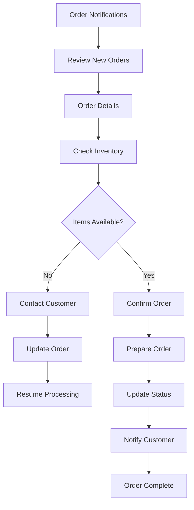

**Steps:**

1. **Order Notification**: Receive new order alerts
2. **Order Review**: Check customer details and requirements
3. **Inventory Check**: Verify product availability
4. **Order Confirmation**: Accept or modify order
5. **Preparation**: Prepare items for pickup/delivery
6. **Status Updates**: Keep customer informed
7. **Completion**: Mark order as delivered

### 4. Analytics Dashboard Flow

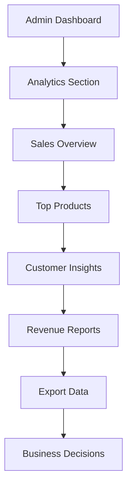

**Steps:**

1. **Dashboard Access**: Navigate to analytics section
2. **Data Review**: Analyze sales and performance metrics
3. **Report Generation**: Create custom reports
4. **Data Export**: Download data for external analysis
5. **Action Planning**: Make business decisions based on insights

---

## 🔧 Super Admin User Flows

### 1. Platform Management Flow

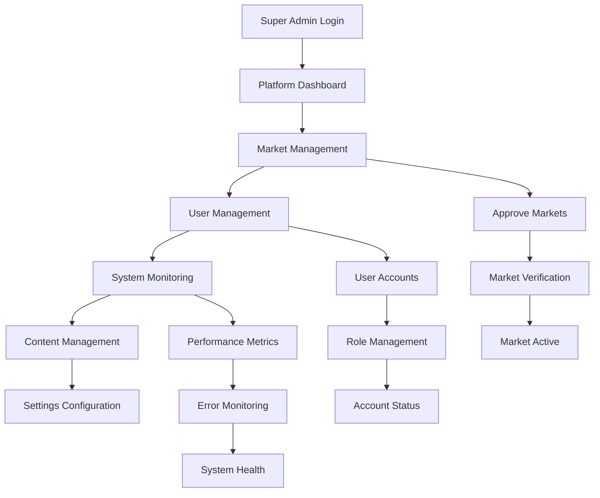

**Steps:**

1. **Platform Overview**: Monitor overall system health
2. **Market Approval**: Review and approve new markets
3. **User Management**: Manage customer and admin accounts
4. **System Monitoring**: Track performance and errors
5. **Content Management**: Manage platform content and settings

### 2. Support & Maintenance Flow

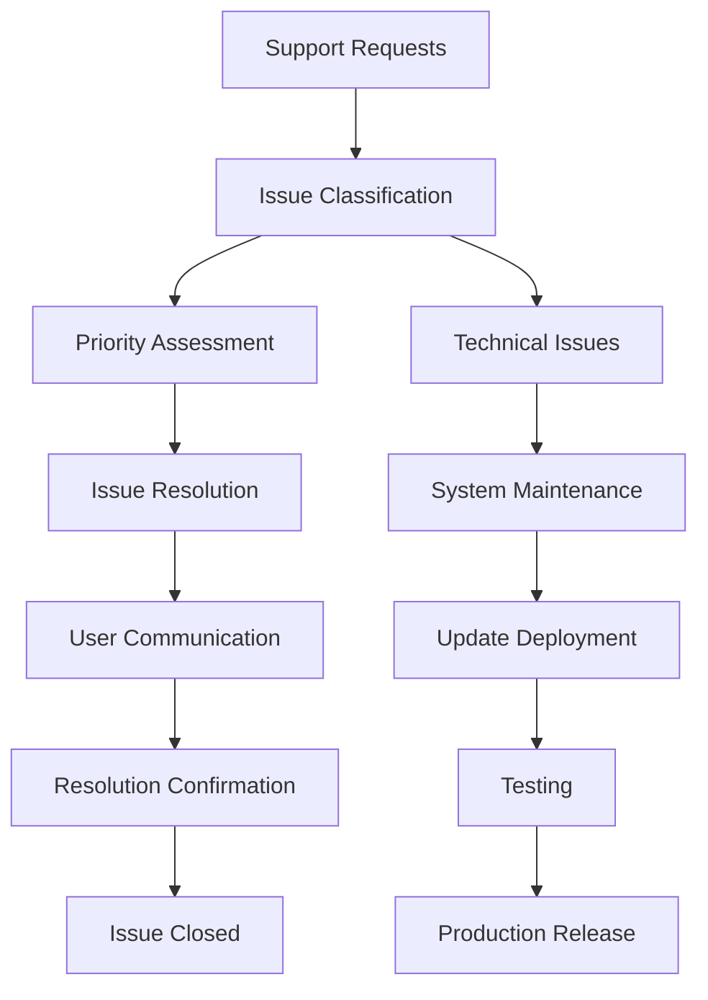

**Steps:**

1. **Issue Detection**: Monitor system for problems
2. **Issue Classification**: Categorize and prioritize issues
3. **Resolution Process**: Implement fixes and updates
4. **User Communication**: Keep users informed of changes
5. **Quality Assurance**: Test changes before deployment

---

## 🎨 Accessibility User Flows

### 1. Font Size Adjustment Flow

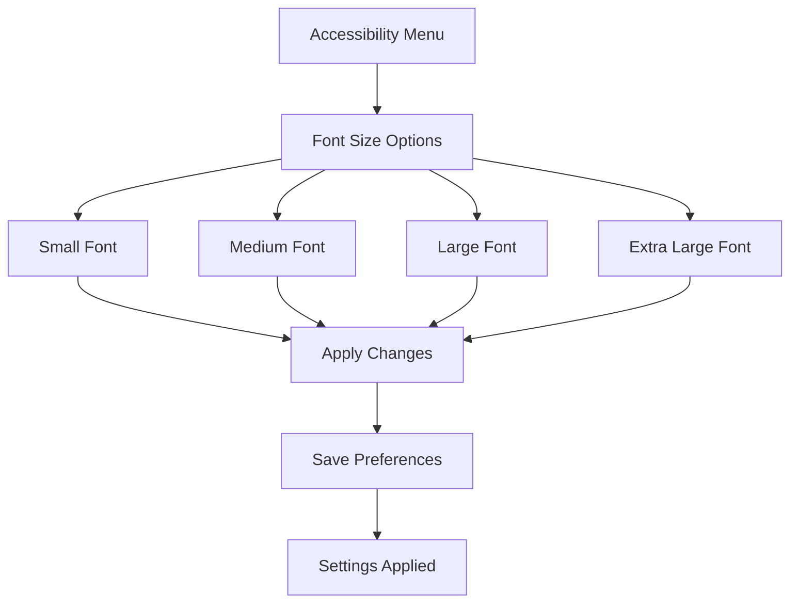

### 2. Theme Selection Flow

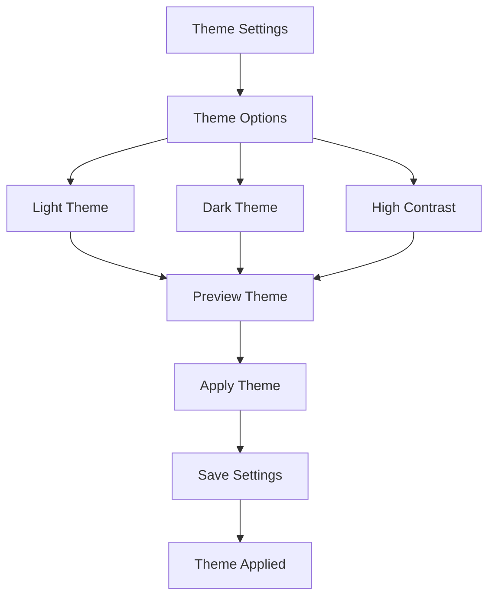

### 3. Language Selection Flow

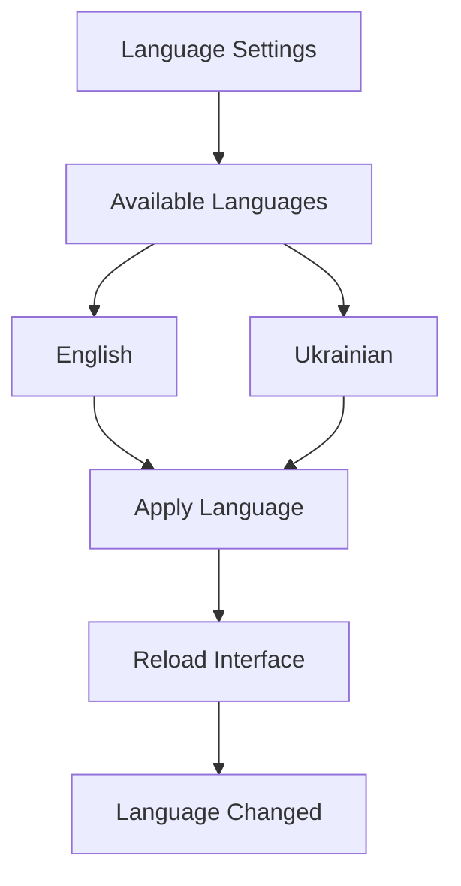

---

## 📱 Mobile User Flows

### 1. Mobile Navigation Flow

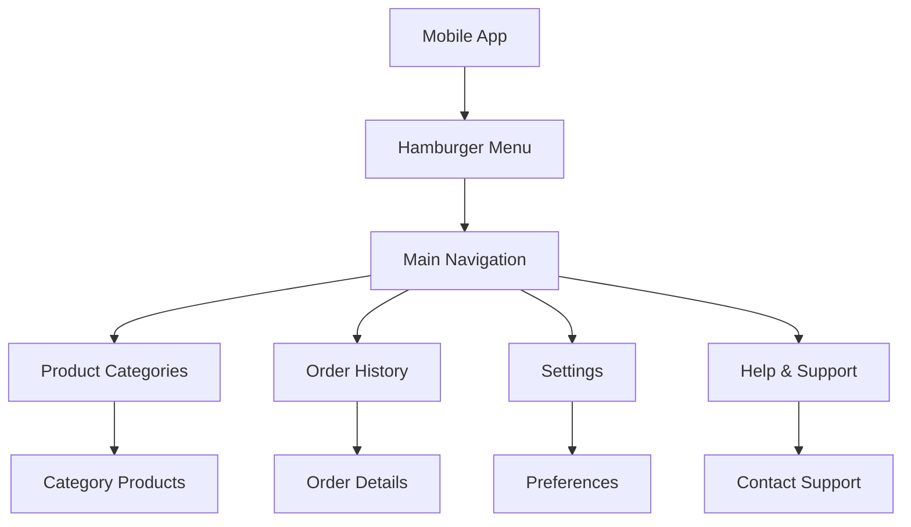

### 2. Touch Interaction Flow

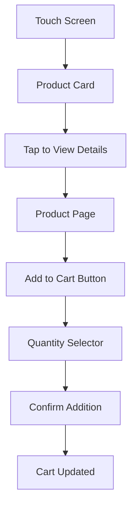

---

## 🔄 Error Handling Flows

### 1. Network Error Flow

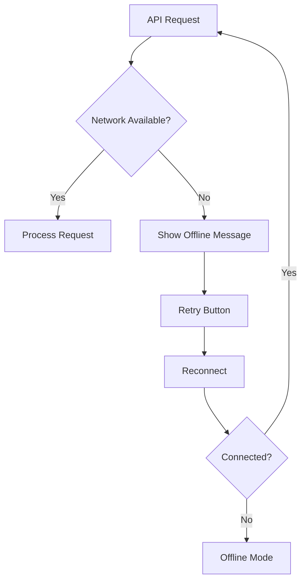

### 2. Payment Error Flow

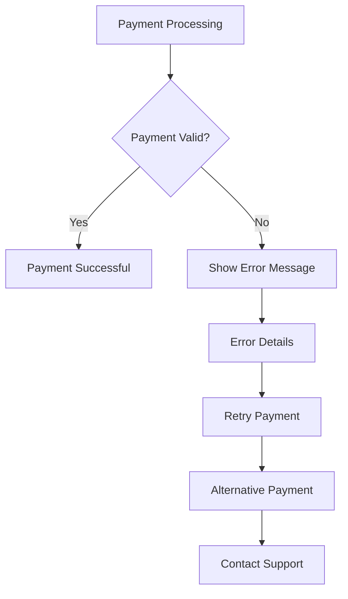

### 3. Order Error Flow

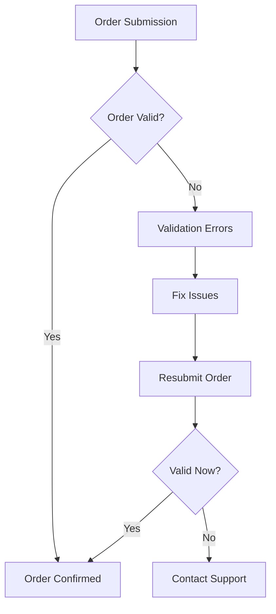

---

## 📊 User Flow Analytics

### Key Metrics to Track

- **Conversion Rate**: Registration to first order
- **Drop-off Points**: Where users abandon the process
- **Time to Complete**: How long each flow takes
- **Error Rates**: Frequency of errors in each step
- **User Satisfaction**: Feedback scores for each flow

### Optimization Strategies

- **A/B Testing**: Test different flow variations
- **User Feedback**: Collect qualitative feedback
- **Performance Monitoring**: Track load times and errors
- **Accessibility Audits**: Regular accessibility testing
- **Mobile Optimization**: Ensure mobile-friendly flows
